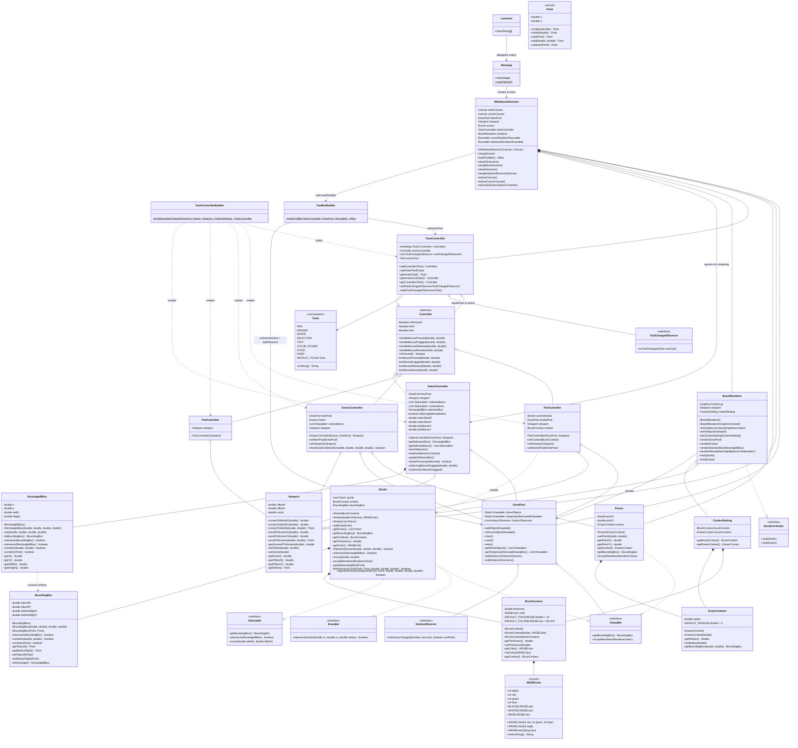

# Whiteboard — Class Diagram (Mermaid)

```mermaid
classDiagram
    %% ─────────────────────────────────────────────────────────────────────
    %% ENTRY POINT
    %% ─────────────────────────────────────────────────────────────────────
    class Launcher {
        +main(String[])
    }
    class MainApp {
        +start(Stage)
        +main(String[])$
    }
    class WhiteboardSession {
        -Canvas mainCanvas
        -Canvas cursorCanvas
        -DrewPool drewPool
        -Viewport viewport
        -Eraser eraser
        -ToolsController toolsController
        -BoardRenderer renderer
        -Runnable cursorRendererRunnable
        -Runnable selectionRendererRunnable
        +WhiteboardSession(Canvas, Canvas)
        +setup(Scene)
        +buildToolBar() HBox
        -setupObservers()
        -setupMouseEvents()
        -setupGestures()
        -setupKeyboardShortcuts(Scene)
        -redrawCanvas()
        -redrawCursorCanvas()
        -redrawSelection(SelectController)
    }

    Launcher --> MainApp : delegates main()
    MainApp --> WhiteboardSession : creates & wires

    %% ─────────────────────────────────────────────────────────────────────
    %% MODEL — CORE
    %% ─────────────────────────────────────────────────────────────────────
    class DrewPool {
        -Stack~Drawable~ drewObjects
        -Stack~Drawable~ temporaryRemovedDrawables
        -List~HistoryObserver~ historyObservers
        +addObject(Drawable)
        +removeObject(Drawable)
        +clear()
        +undo()
        +redo()
        +getDrewObjects() List~Drawable~
        +getTemporaryRemovedDrawables() List~Drawable~
        +addObserver(HistoryObserver)
        -notifyHistoryObservers()
    }

    class Viewport {
        -double offsetX
        -double offsetY
        -double zoom
        +screenToWorldX(double) double
        +screenToWorldY(double) double
        +screenToWorld(double, double) Point
        +worldToScreenX(double) double
        +worldToScreenY(double) double
        +worldToScreen(double, double) Point
        +getZoomedThickness(double) double
        +setOffset(double, double)
        +setZoom(double)
        +getZoom() double
        +getOffsetX() double
        +getOffsetY() double
        +getOffset() Point
    }

    %% ─────────────────────────────────────────────────────────────────────
    %% MODEL — VALUE OBJECTS
    %% ─────────────────────────────────────────────────────────────────────
    class Point {
        <<record>>
        +double x
        +double y
        +multiply(double) Point
        +divide(double) Point
        +add(Point) Point
        +add(double, double) Point
        +subtract(Point) Point
    }

    class ARGBColor {
        <<record>>
        +int alpha
        +int red
        +int green
        +int blue
        +BLACK$ ARGBColor
        +WHITE$ ARGBColor
        +RED$ ARGBColor
        +ARGBColor(int red, int green, int blue)
        +ARGBColor(int argb)
        +ARGBColor(String hex)
        +toHexString() String
    }

    %% ─────────────────────────────────────────────────────────────────────
    %% MODEL — CONTEXT OBJECTS
    %% ─────────────────────────────────────────────────────────────────────
    class BrushContext {
        -double thickness
        -ARGBColor color
        -DEFAULT_THICKNESS$ double = 10
        -DEFAULT_COLOR$ ARGBColor = BLACK
        +BrushContext()
        +BrushContext(double, ARGBColor)
        +BrushContext(BrushContext)
        +getThickness() double
        +setThickness(double)
        +getColor() ARGBColor
        +setColor(ARGBColor)
        +getContext() BrushContext
    }

    class EraserContext {
        -double radius
        -DEFAULT_RADIUS$ double = 5
        +EraserContext()
        +EraserContext(double)
        +getRadius() double
        +setRadius(double)
        +getBoundingBox(double, double) BoundingBox
    }

    class ContextSetting {
        -BrushContext brushContext
        -EraserContext eraserContext
        +getBrushContext() BrushContext
        +getEraserContext() EraserContext
    }

    BrushContext *-- ARGBColor
    ContextSetting *-- BrushContext
    ContextSetting *-- EraserContext

    %% ─────────────────────────────────────────────────────────────────────
    %% MODEL — UTILS
    %% ─────────────────────────────────────────────────────────────────────
    class BoundingBox {
        -double topLeftX
        -double topLeftY
        -double bottomRightX
        -double bottomRightY
        +BoundingBox()
        +BoundingBox(double, double, double, double)
        +BoundingBox(Point, Point)
        +intersects(BoundingBox) boolean
        +contains(double, double) boolean
        +contains(Point) boolean
        +getTopLeft() Point
        +getBottomRight() Point
        +setTopLeft(Point)
        +setBottomRight(Point)
        +toRectangle() RectangleBBox
    }

    class RectangleBBox {
        -double x
        -double y
        -double width
        -double height
        +RectangleBBox()
        +RectangleBBox(double, double, double, double)
        +set(double, double, double, double)
        +toBoundingBox() BoundingBox
        +intersects(BoundingBox) boolean
        +intersects(RectangleBBox) boolean
        +contains(double, double) boolean
        +contains(Point) boolean
        +getX() double
        +getY() double
        +getWidth() double
        +getHeight() double
    }

    RectangleBBox ..> BoundingBox : converts to/from

    %% ─────────────────────────────────────────────────────────────────────
    %% INTERFACES
    %% ─────────────────────────────────────────────────────────────────────
    class Drawable {
        <<interface>>
        +getBoundingBox() BoundingBox
        +acceptRenderer(RendererVisitor)
    }

    class Erasable {
        <<interface>>
        +intersectsEraser(double cx, double cy, double radius) boolean
    }

    class Selectable {
        <<interface>>
        +getBoundingBox() BoundingBox
        +intersects(RectangleBBox) boolean
        +move(double deltaX, double deltaY)
    }

    class HistoryObserver {
        <<interface>>
        +onHistoryChanged(boolean canUndo, boolean canRedo)
    }

    class ToolChangedObserver {
        <<interface>>
        +onToolChanged(Tools newTool)
    }

    class RendererVisitor {
        <<interface>>
        +visit(Stroke)
        +visit(Eraser)
    }

    %% ─────────────────────────────────────────────────────────────────────
    %% MODEL — DRAWABLE OBJECTS
    %% ─────────────────────────────────────────────────────────────────────
    class Stroke {
        -List~Point~ points
        -BrushContext context
        -BoundingBox boundingBox
        +Stroke(BrushContext)
        +Stroke(double thickness, ARGBColor)
        +Stroke(List~Point~)
        +addPoint(Point)
        +getPoints() List~Point~
        +getBoundingBox() BoundingBox
        +getContext() BrushContext
        +getThickness() double
        +getColor() ARGBColor
        +intersectsEraser(double, double, double) boolean
        +intersects(RectangleBBox) boolean
        +move(double, double)
        +acceptRenderer(RendererVisitor)
        -updateBoundingBox(Point)
        -lineIntersectsCircle(Point, Point, double, double, double) boolean
        -segmentIntersectsSegment(Point, Point, double, double, double, double) boolean
    }

    class Eraser {
        -double pointX
        -double pointY
        -EraserContext context
        +Eraser(EraserContext)
        +setPoint(double, double)
        +getPointX() double
        +getPointY() double
        +getContext() EraserContext
        +getBoundingBox() BoundingBox
        +acceptRenderer(RendererVisitor)
    }

    Stroke ..|> Drawable
    Stroke ..|> Erasable
    Stroke ..|> Selectable
    Stroke *-- BrushContext
    Stroke *-- BoundingBox

    Eraser ..|> Drawable
    Eraser *-- EraserContext

    DrewPool o-- Drawable
    DrewPool o-- HistoryObserver

    %% ─────────────────────────────────────────────────────────────────────
    %% CONTROLLER — ABSTRACT (Template Method)
    %% ─────────────────────────────────────────────────────────────────────
    class Controller {
        <<abstract>>
        #boolean isPressed
        #double lastX
        #double lastY
        +handleMousePressed(double, double)
        +handleMouseDragged(double, double)
        +handleMouseReleased(double, double)
        +handleMouseMoved(double, double)
        +isPressed() boolean
        #onMousePressed(double, double)*
        #onMouseDragged(double, double)*
        #onMouseReleased(double, double)*
        #onMouseMoved(double, double)*
    }

    %% ─────────────────────────────────────────────────────────────────────
    %% CONTROLLER — CONCRETE
    %% ─────────────────────────────────────────────────────────────────────
    class ToolsController {
        -HashMap~Tools,Controller~ controllers
        -Controller activeController
        -List~ToolChangedObserver~ toolChangedObservers
        -Tools activeTool
        +addController(Tools, Controller)
        +setActiveTool(Tools)
        +getActiveTool() Tools
        +getActiveController() Controller
        +getController(Tools) Controller
        +addToolChangedObserver(ToolChangedObserver)
        -notifyToolChangedObservers(Tools)
    }

    class PenController {
        -Stroke currentStroke
        -DrewPool strokePool
        -Viewport viewport
        -BrushContext context
        +PenController(DrewPool, Viewport)
        +setContext(BrushContext)
        +setViewport(Viewport)
        +setStrokePool(DrewPool)
    }

    class EraserController {
        -DrewPool itemPool
        -Eraser eraser
        -List~Drawable~ contextItems
        -Viewport viewport
        +EraserController(Eraser, DrewPool, Viewport)
        +setItemPool(DrewPool)
        +setViewport(Viewport)
        -checkExactCollision(Erasable, double, double, double) boolean
    }

    class PanController {
        -Viewport viewport
        +PanController(Viewport)
    }

    class SelectController {
        -DrewPool itemPool
        -Viewport viewport
        -List~Selectable~ selectedItems
        -List~Selectable~ contextItems
        -RectangleBBox selectionBox
        -boolean isMovingSelectedItems
        -double selectStartX
        -double selectStartY
        -double lastMouseX
        -double lastMouseY
        +SelectController(DrewPool, Viewport)
        +getSelectionBox() RectangleBBox
        +getSelectedItems() List~Selectable~
        +clearSelection()
        -initializeSelectionContext()
        -updateSelectionBox()
        -checkPreviouslySelected() boolean
        -onMovingMouseDragged(double, double)
        -onSelectionMouseDragged()
    }

    class Tools {
        <<enumeration>>
        PEN
        ERASER
        SHAPE
        SELECTION
        TEXT
        COLOR_PICKER
        ZOOM
        HAND
        DEFAULT_TOOL$ Tools
        +toString() String
    }

    class ToolsControllerBuilder {
        +buildStandardToolset(DrewPool, Eraser, Viewport, ContextSetting)$ ToolsController
    }

    Controller <|-- ToolsController
    Controller <|-- PenController
    Controller <|-- EraserController
    Controller <|-- PanController
    Controller <|-- SelectController

    ToolsController o-- Controller : dispatches to active
    ToolsController o-- ToolChangedObserver
    ToolsController --> Tools

    PenController o-- DrewPool
    PenController o-- Viewport
    PenController ..> Stroke : creates

    EraserController o-- Eraser
    EraserController o-- DrewPool
    EraserController o-- Viewport

    PanController o-- Viewport

    SelectController o-- DrewPool
    SelectController o-- Viewport
    SelectController *-- RectangleBBox

    ToolsControllerBuilder ..> ToolsController : builds
    ToolsControllerBuilder ..> PenController : creates
    ToolsControllerBuilder ..> EraserController : creates
    ToolsControllerBuilder ..> PanController : creates
    ToolsControllerBuilder ..> SelectController : creates

    %% ─────────────────────────────────────────────────────────────────────
    %% VIEW
    %% ─────────────────────────────────────────────────────────────────────
    class BoardRenderer {
        -GraphicsContext gc
        -Viewport viewport
        -ContextSetting contextSetting
        +BoardRenderer()
        +BoardRenderer(GraphicsContext)
        +setGraphicsContext(GraphicsContext)
        +setViewport(Viewport)
        +setContextSetting(ContextSetting)
        +render(DrewPool)
        +render(Eraser)
        +renderSelectionBox(RectangleBBox)
        +renderSelectedItemHighlight(List~Selectable~)
        +visit(Stroke)
        +visit(Eraser)
    }

    class ToolBarBuilder {
        +buildToolBar(ToolsController, DrewPool, Runnable)$ HBox
    }

    BoardRenderer ..|> RendererVisitor
    BoardRenderer o-- Viewport
    BoardRenderer o-- ContextSetting
    BoardRenderer --> DrewPool : iterates

    ToolBarBuilder --> ToolsController : setActiveTool
    ToolBarBuilder --> DrewPool : undo/redo/clear + addObserver

    %% ─────────────────────────────────────────────────────────────────────
    %% SESSION WIRING
    %% ─────────────────────────────────────────────────────────────────────
    WhiteboardSession *-- DrewPool
    WhiteboardSession *-- Viewport
    WhiteboardSession *-- Eraser
    WhiteboardSession *-- ToolsController
    WhiteboardSession *-- BoardRenderer
    WhiteboardSession --> SelectController : queries for rendering
    WhiteboardSession --> ToolBarBuilder : calls buildToolBar
```
