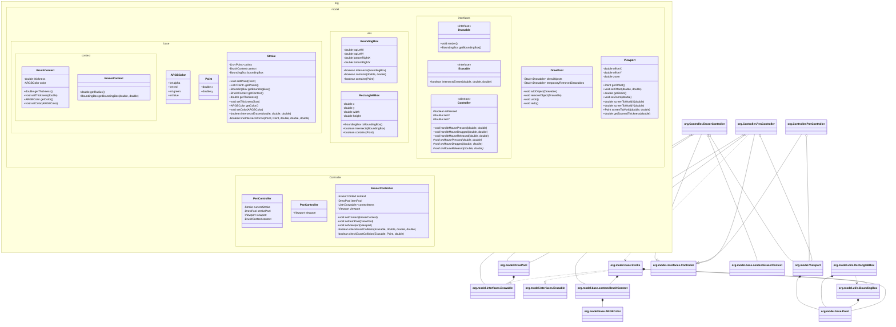

```mermaid
classDiagram
    namespace org.model.base {
        class ARGBColor {
            +int alpha
            +int red
            +int green
            +int blue
        }

        class Point {
            +double x
            +double y
        }

        class Stroke {
            -List~Point~ points
            -BrushContext context
            -BoundingBox boundingBox
            +void addPoint(Point)
            +List~Point~ getPoints()
            +BoundingBox getBoundingBox()
            +BrushContext getContext()
            +double getThickness()
            +void setThickness(float)
            +ARGBColor getColor()
            +void setColor(ARGBColor)
            +boolean intersectsEraser(double, double, double)
            -boolean lineIntersectsCircle(Point, Point, double, double, double)
        }
    }

    namespace org.model.base.context {
        class BrushContext {
            -double thickness
            -ARGBColor color
            +double getThickness()
            +void setThickness(double)
            +ARGBColor getColor()
            +void setColor(ARGBColor)
        }
        
        class EraserContext {
            +double getRadius()
            +BoundingBox getBoundingBox(double, double)
        }
    }

    namespace org.model.utils {
        class BoundingBox {
            -double topLeftX
            -double topLeftY
            -double bottomRightX
            -double bottomRightY
            +boolean intersects(BoundingBox)
            +boolean contains(double, double)
            +boolean contains(Point)
        }

        class RectangleBBox {
            -double x
            -double y
            -double width
            -double height
            +BoundingBox toBoundingBox()
            +boolean intersects(BoundingBox)
            +boolean contains(Point)
        }
    }

    namespace org.model.interfaces {
        class Drawable {
            <<interface>>
            +void render()
            +BoundingBox getBoundingBox()
        }

        class Erasable {
            <<interface>>
            +boolean intersectsEraser(double, double, double)
        }

        class Controller {
            <<abstract>>
            #boolean isPressed
            #double lastX
            #double lastY
            +void handleMousePressed(double, double)
            +void handleMouseDragged(double, double)
            +void handleMouseReleased(double, double)
            #void onMousePressed(double, double)*
            #void onMouseDragged(double, double)*
            #void onMouseReleased(double, double)*
        }
    }

    namespace org.model {
        class DrewPool {
            -Stack~Drawable~ drewObjects
            -Stack~Drawable~ temporaryRemovedDrawables
            +void addObject(Drawable)
            +void removeObject(Drawable)
            +void undo()
            +void redo()
        }

        class Viewport {
            -double offsetX
            -double offsetY
            -double zoom
            +Point getOffset()
            +void setOffset(double, double)
            +double getZoom()
            +void setZoom(double)
            +double screenToWorldX(double)
            +double screenToWorldY(double)
            +Point screenToWorld(double, double)
            +double getZoomedThickness(double)
        }
    }

    namespace org.Controller {
        class PenController {
            -Stroke currentStroke
            -DrewPool strokePool
            -Viewport viewport
            -BrushContext context
        }

        class PanController {
            -Viewport viewport
        }

        class EraserController {
            -EraserContext context
            -DrewPool itemPool
            -List~Drawable~ contextItems
            -Viewport viewport
            +void setContext(EraserContext)
            +void setItemPool(DrewPool)
            +void setViewport(Viewport)
            -boolean checkExactCollision(Erasable, double, double, double)
            -boolean checkExactCollision(Erasable, Point, double)
        }
    }

    org.model.base.Stroke ..|> org.model.interfaces.Drawable
    org.model.base.Stroke ..|> org.model.interfaces.Erasable
    org.model.base.Stroke *-- org.model.base.Point
    org.model.base.Stroke *-- org.model.base.context.BrushContext
    org.model.base.Stroke *-- org.model.utils.BoundingBox
    org.model.base.context.BrushContext *-- org.model.base.ARGBColor
    
    org.model.utils.BoundingBox *-- org.model.base.Point
    org.model.utils.RectangleBBox *-- org.model.base.Point
    org.model.utils.RectangleBBox ..> org.model.utils.BoundingBox

    org.model.DrewPool *-- org.model.interfaces.Drawable

    org.model.Viewport *-- org.model.base.Point

    org.Controller.PenController --|> org.model.interfaces.Controller
    org.Controller.PenController o-- org.model.DrewPool
    org.Controller.PenController o-- org.model.Viewport
    org.Controller.PenController o-- org.model.base.context.BrushContext
    org.Controller.PenController ..> org.model.base.Stroke
    
    org.Controller.PanController --|> org.model.interfaces.Controller
    org.Controller.PanController o-- org.model.Viewport

    org.Controller.EraserController --|> org.model.interfaces.Controller
    org.Controller.EraserController o-- org.model.base.context.EraserContext
    org.Controller.EraserController o-- org.model.DrewPool
    org.Controller.EraserController o-- org.model.Viewport
    org.Controller.EraserController o-- org.model.interfaces.Drawable
```
