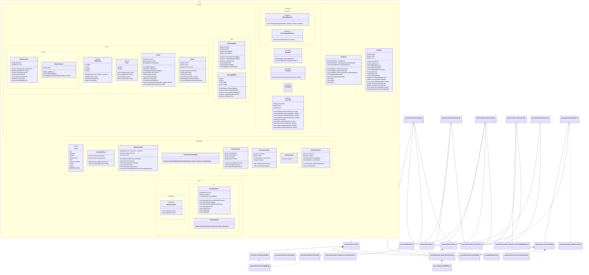

```mermaid
classDiagram
    namespace org.model.base {
        class ARGBColor {
            <<record>>
            +int alpha
            +int red
            +int green
            +int blue
            +ARGBColor(int red, int green, int blue)
            +ARGBColor(int argb)
            +ARGBColor(String hex)
            +String toHexString()
        }

        class Point {
            <<record>>
            +double x
            +double y
            +Point multiply(double factor)
            +Point divide(double factor)
            +Point add(Point other)
            +Point subtract(Point other)
        }

        class Stroke {
            -List~Point~ points
            -BrushContext context
            -BoundingBox boundingBox
            +void addPoint(Point)
            +List~Point~ getPoints()
            +BoundingBox getBoundingBox()
            +BrushContext getContext()
            +double getThickness()
            +void setThickness(float)
            +ARGBColor getColor()
            +void setColor(ARGBColor)
            +boolean intersectsEraser(double, double, double)
            +void acceptRenderer(RendererVisitor)
        }

        class Eraser {
            -double pointX
            -double pointY
            -EraserContext context
            +EraserContext getContext()
            +double getPointX()
            +double getPointY()
            +void setPoint(double, double)
            +BoundingBox getBoundingBox()
            +void acceptRenderer(RendererVisitor)
        }
    }

    namespace org.model.base.context {
        class BrushContext {
            -double thickness
            -ARGBColor color
            +BrushContext(double, ARGBColor)
            +BrushContext(BrushContext)
            +BrushContext getContext()
            +double getThickness()
            +void setThickness(double)
            +ARGBColor getColor()
            +void setColor(ARGBColor)
        }

        class EraserContext {
            -double radius
            +double getRadius()
            +void setRadius(double)
            +BoundingBox getBoundingBox(double, double)
        }
    }

    namespace org.model.utils {
        class BoundingBox {
            -double topLeftX
            -double topLeftY
            -double bottomRightX
            -double bottomRightY
            +boolean intersects(BoundingBox)
            +boolean contains(double, double)
            +boolean contains(Point)
            +Point getTopLeft()
            +Point getBottomRight()
            +RectangleBBox toRectangle()
        }

        class RectangleBBox {
            -double x
            -double y
            -double width
            -double height
            +BoundingBox toBoundingBox()
            +boolean intersects(BoundingBox)
            +boolean intersects(RectangleBBox)
            +boolean contains(double, double)
            +boolean contains(Point)
        }
    }

    namespace org.model.interfaces {
        class Drawable {
            <<interface>>
            +BoundingBox getBoundingBox()
            +void acceptRenderer(RendererVisitor)
        }

        class Erasable {
            <<interface>>
            +boolean intersectsEraser(double, double, double)
        }

        class Selectable {
            <<interface>>
        }

        class Controller {
            <<abstract>>
            #boolean isPressed
            #double lastX
            #double lastY
            +void handleMouseMoved(double, double)
            +void handleMousePressed(double, double)
            +void handleMouseDragged(double, double)
            +void handleMouseReleased(double, double)
            +boolean isPressed()
            #void onMouseMoved(double, double)*
            #void onMousePressed(double, double)*
            #void onMouseDragged(double, double)*
            #void onMouseReleased(double, double)*
        }
    }

    namespace org.model.interfaces.observers {
        class HistoryObserver {
            <<interface>>
            +void onHistoryChanged(boolean canUndo, boolean canRedo)
        }

        class ToolChangedObserver {
            <<interface>>
            +void onToolChanged(Tools newTool)
        }
    }

    namespace org.model {
        class DrewPool {
            -Stack~Drawable~ drewObjects
            -Stack~Drawable~ temporaryRemovedDrawables
            -List~HistoryObserver~ historyObservers
            +void addObserver(HistoryObserver)
            +List~Drawable~ getDrewObjects()
            +List~Drawable~ getTemporaryRemovedDrawables()
            +void addObject(Drawable)
            +void removeObject(Drawable)
            +void clear()
            +void undo()
            +void redo()
        }

        class Viewport {
            -double offsetX
            -double offsetY
            -double zoom
            +double getOffsetX()
            +double getOffsetY()
            +void setOffsetX(double)
            +void setOffsetY(double)
            +void setOffset(double, double)
            +Point getOffset()
            +double getZoom()
            +void setZoom(double)
            +double screenToWorldX(double)
            +double screenToWorldY(double)
            +Point screenToWorld(double, double)
            +double worldToScreenX(double)
            +double worldToScreenY(double)
            +Point worldToScreen(double, double)
            +double getZoomedThickness(double)
        }
    }

    namespace org.Controller {
        class Tools {
            <<enum>>
            PEN
            ERASER
            SHAPE
            SELECTION
            TEXT
            COLOR_PICKER
            ZOOM
            HAND
            DEFAULT_TOOL$
        }

        class ContextSetting {
            -BrushContext brushContext
            -EraserContext eraserContext
            +BrushContext getBrushContext()
            +EraserContext getEraserContext()
        }

        class ToolsController {
            -HashMap~Tools, Controller~ controllers
            -Controller activeController
            -Tools activeTool
            +void addController(Tools, Controller)
            +void setActiveTool(Tools)
            +Controller getActiveController()
            +Tools getActiveTool()
            +Controller getController(Tools)
            +void addToolChangedObserver(ToolChangedObserver)
        }

        class ToolsControllerBuilder {
            +ToolsController buildStandardToolset(DrewPool, Eraser, Viewport, ContextSetting)$
        }

        class PenController {
            -Stroke currentStroke
            -DrewPool strokePool
            -Viewport viewport
            -BrushContext context
            +void setContext(BrushContext)
            +void setViewport(Viewport)
            +void setStrokePool(DrewPool)
        }

        class EraserController {
            -DrewPool itemPool
            -Eraser eraser
            -List~Drawable~ contextItems
            -Viewport viewport
            +void setItemPool(DrewPool)
            +void setViewport(Viewport)
        }

        class PanController {
            -Viewport viewport
        }

        class SelectController {
            -DrewPool itemPool
            -Viewport viewport
            -List~Drawable~ selectedItems
            -List~Drawable~ contextItems
            +List~Drawable~ getSelectedItems()
            +void clearSelection()
        }
    }

    namespace org.view.interfaces {
        class RendererVisitor {
            <<interface>>
            +void visit(Stroke stroke)
            +void visit(Eraser eraser)
        }
    }

    namespace org.view.jfx {
        class BoardRenderer {
            -GraphicsContext gc
            -Viewport viewport
            -ContextSetting contextSetting
            +void setGraphicsContext(GraphicsContext)
            +void setViewport(Viewport)
            +void setContextSetting(ContextSetting)
            +void render(DrewPool)
            +void render(Eraser)
            +void visit(Stroke)
            +void visit(Eraser)
        }

        class ToolBarBuilder {
            +HBox buildToolBar(ToolsController, DrewPool, Runnable)$
        }
    }

    %% model.base
    org.model.base.Stroke ..|> org.model.interfaces.Drawable
    org.model.base.Stroke ..|> org.model.interfaces.Erasable
    org.model.base.Stroke ..|> org.model.interfaces.Selectable
    org.model.base.Stroke *-- org.model.base.context.BrushContext
    org.model.base.Stroke *-- org.model.utils.BoundingBox

    org.model.base.Eraser ..|> org.model.interfaces.Drawable
    org.model.base.Eraser *-- org.model.base.context.EraserContext

    org.model.base.context.BrushContext *-- org.model.base.ARGBColor

    %% model.utils
    org.model.utils.BoundingBox ..> org.model.utils.RectangleBBox
    org.model.utils.RectangleBBox ..> org.model.utils.BoundingBox

    %% model
    org.model.DrewPool o-- org.model.interfaces.Drawable
    org.model.DrewPool o-- org.model.interfaces.observers.HistoryObserver
    org.model.Viewport ..> org.model.base.Point

    %% Controller
    org.Controller.ToolsController --|> org.model.interfaces.Controller
    org.Controller.ToolsController o-- org.model.interfaces.Controller
    org.Controller.ToolsController o-- org.model.interfaces.observers.ToolChangedObserver

    org.Controller.PenController --|> org.model.interfaces.Controller
    org.Controller.PenController o-- org.model.DrewPool
    org.Controller.PenController o-- org.model.Viewport
    org.Controller.PenController o-- org.model.base.context.BrushContext
    org.Controller.PenController ..> org.model.base.Stroke

    org.Controller.EraserController --|> org.model.interfaces.Controller
    org.Controller.EraserController o-- org.model.base.Eraser
    org.Controller.EraserController o-- org.model.DrewPool
    org.Controller.EraserController o-- org.model.Viewport

    org.Controller.PanController --|> org.model.interfaces.Controller
    org.Controller.PanController o-- org.model.Viewport

    org.Controller.SelectController --|> org.model.interfaces.Controller
    org.Controller.SelectController o-- org.model.DrewPool
    org.Controller.SelectController o-- org.model.Viewport

    org.Controller.ContextSetting *-- org.model.base.context.BrushContext
    org.Controller.ContextSetting *-- org.model.base.context.EraserContext

    %% view
    org.view.jfx.BoardRenderer ..|> org.view.interfaces.RendererVisitor
    org.view.jfx.BoardRenderer o-- org.model.Viewport
    org.view.jfx.BoardRenderer o-- org.Controller.ContextSetting
```