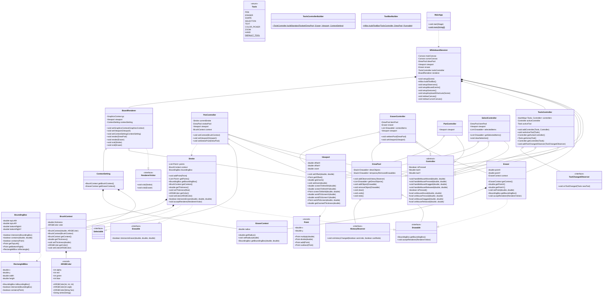

```mermaid
classDiagram

    %% ── Interfaces ───────────────────────────────────────────

    class Drawable {
        <<interface>>
        +BoundingBox getBoundingBox()
        +void acceptRenderer(RendererVisitor)
    }
    class Erasable {
        <<interface>>
        +boolean intersectsEraser(double, double, double)
    }
    class Selectable {
        <<interface>>
    }
    class Controller {
        <<abstract>>
        #boolean isPressed
        #double lastX
        #double lastY
        +void handleMouseMoved(double, double)
        +void handleMousePressed(double, double)
        +void handleMouseDragged(double, double)
        +void handleMouseReleased(double, double)
        +boolean isPressed()
        #void onMouseMoved(double, double)*
        #void onMousePressed(double, double)*
        #void onMouseDragged(double, double)*
        #void onMouseReleased(double, double)*
    }
    class RendererVisitor {
        <<interface>>
        +void visit(Stroke)
        +void visit(Eraser)
    }
    class HistoryObserver {
        <<interface>>
        +void onHistoryChanged(boolean canUndo, boolean canRedo)
    }
    class ToolChangedObserver {
        <<interface>>
        +void onToolChanged(Tools newTool)
    }

    %% ── Value objects ────────────────────────────────────────

    class ARGBColor {
        <<record>>
        +int alpha
        +int red
        +int green
        +int blue
        +ARGBColor(int, int, int)
        +ARGBColor(int argb)
        +ARGBColor(String hex)
        +String toHexString()
    }
    class Point {
        <<record>>
        +double x
        +double y
        +Point multiply(double)
        +Point divide(double)
        +Point add(Point)
        +Point subtract(Point)
    }
    class BoundingBox {
        -double topLeftX
        -double topLeftY
        -double bottomRightX
        -double bottomRightY
        +boolean intersects(BoundingBox)
        +boolean contains(double, double)
        +boolean contains(Point)
        +Point getTopLeft()
        +Point getBottomRight()
        +RectangleBBox toRectangle()
    }
    BoundingBox ..> RectangleBBox

    class RectangleBBox {
        -double x
        -double y
        -double width
        -double height
        +BoundingBox toBoundingBox()
        +boolean intersects(BoundingBox)
        +boolean contains(Point)
    }
    RectangleBBox ..> BoundingBox

    %% ── Context ──────────────────────────────────────────────

    class BrushContext {
        -double thickness
        -ARGBColor color
        +BrushContext(double, ARGBColor)
        +BrushContext(BrushContext)
        +BrushContext getContext()
        +double getThickness()
        +void setThickness(double)
        +ARGBColor getColor()
        +void setColor(ARGBColor)
    }
    BrushContext *-- ARGBColor

    class EraserContext {
        -double radius
        +double getRadius()
        +void setRadius(double)
        +BoundingBox getBoundingBox(double, double)
    }

    class ContextSetting {
        +BrushContext getBrushContext()
        +EraserContext getEraserContext()
    }
    ContextSetting *-- BrushContext
    ContextSetting *-- EraserContext

    %% ── Drawables ────────────────────────────────────────────

    class Stroke {
        -List~Point~ points
        -BrushContext context
        -BoundingBox boundingBox
        +void addPoint(Point)
        +List~Point~ getPoints()
        +BoundingBox getBoundingBox()
        +BrushContext getContext()
        +double getThickness()
        +void setThickness(float)
        +ARGBColor getColor()
        +void setColor(ARGBColor)
        +boolean intersectsEraser(double, double, double)
        +void acceptRenderer(RendererVisitor)
    }
    Stroke ..|> Drawable
    Stroke ..|> Erasable
    Stroke ..|> Selectable
    Stroke *-- BrushContext
    Stroke *-- BoundingBox

    class Eraser {
        -double pointX
        -double pointY
        -EraserContext context
        +EraserContext getContext()
        +double getPointX()
        +double getPointY()
        +void setPoint(double, double)
        +BoundingBox getBoundingBox()
        +void acceptRenderer(RendererVisitor)
    }
    Eraser ..|> Drawable
    Eraser *-- EraserContext

    %% ── Model ────────────────────────────────────────────────

    class DrewPool {
        -Stack~Drawable~ drewObjects
        -Stack~Drawable~ temporaryRemovedDrawables
        +void addObserver(HistoryObserver)
        +List~Drawable~ getDrewObjects()
        +void addObject(Drawable)
        +void removeObject(Drawable)
        +void clear()
        +void undo()
        +void redo()
    }
    DrewPool o-- Drawable
    DrewPool o-- HistoryObserver

    class Viewport {
        -double offsetX
        -double offsetY
        -double zoom
        +void setOffset(double, double)
        +Point getOffset()
        +double getZoom()
        +void setZoom(double)
        +double screenToWorldX(double)
        +double screenToWorldY(double)
        +Point screenToWorld(double, double)
        +double worldToScreenX(double)
        +double worldToScreenY(double)
        +Point worldToScreen(double, double)
        +double getZoomedThickness(double)
    }
    Viewport ..> Point

    %% ── Controllers ──────────────────────────────────────────

    class Tools {
        <<enum>>
        PEN
        ERASER
        SHAPE
        SELECTION
        TEXT
        COLOR_PICKER
        ZOOM
        HAND
        DEFAULT_TOOL$
    }

    class ToolsController {
        -HashMap~Tools, Controller~ controllers
        -Controller activeController
        -Tools activeTool
        +void addController(Tools, Controller)
        +void setActiveTool(Tools)
        +Controller getActiveController()
        +Tools getActiveTool()
        +Controller getController(Tools)
        +void addToolChangedObserver(ToolChangedObserver)
    }
    ToolsController --|> Controller
    ToolsController o-- Controller
    ToolsController o-- ToolChangedObserver

    class ToolsControllerBuilder {
        +ToolsController buildStandardToolset(DrewPool, Eraser, Viewport, ContextSetting)$
    }

    class PenController {
        -Stroke currentStroke
        -DrewPool strokePool
        -Viewport viewport
        -BrushContext context
        +void setContext(BrushContext)
        +void setViewport(Viewport)
        +void setStrokePool(DrewPool)
    }
    PenController --|> Controller
    PenController o-- DrewPool
    PenController o-- Viewport
    PenController o-- BrushContext
    PenController ..> Stroke

    class EraserController {
        -DrewPool itemPool
        -Eraser eraser
        -List~Drawable~ contextItems
        -Viewport viewport
        +void setItemPool(DrewPool)
        +void setViewport(Viewport)
    }
    EraserController --|> Controller
    EraserController o-- Eraser
    EraserController o-- DrewPool
    EraserController o-- Viewport

    class PanController {
        -Viewport viewport
    }
    PanController --|> Controller
    PanController o-- Viewport

    class SelectController {
        -DrewPool itemPool
        -Viewport viewport
        -List~Drawable~ selectedItems
        +List~Drawable~ getSelectedItems()
        +void clearSelection()
    }
    SelectController --|> Controller
    SelectController o-- DrewPool
    SelectController o-- Viewport

    %% ── View ─────────────────────────────────────────────────

    class BoardRenderer {
        -GraphicsContext gc
        -Viewport viewport
        -ContextSetting contextSetting
        +void setGraphicsContext(GraphicsContext)
        +void setViewport(Viewport)
        +void setContextSetting(ContextSetting)
        +void render(DrewPool)
        +void render(Eraser)
        +void visit(Stroke)
        +void visit(Eraser)
    }
    BoardRenderer ..|> RendererVisitor
    BoardRenderer o-- Viewport
    BoardRenderer o-- ContextSetting

    class ToolBarBuilder {
        +HBox buildToolBar(ToolsController, DrewPool, Runnable)$
    }

    %% ── App wiring ───────────────────────────────────────────

    class WhiteboardSession {
        -Canvas mainCanvas
        -Canvas cursorCanvas
        -DrewPool drewPool
        -Viewport viewport
        -Eraser eraser
        -ToolsController toolsController
        -BoardRenderer renderer
        +void setup(Scene)
        +HBox buildToolBar()
        -void setupObservers()
        -void setupMouseEvents()
        -void setupGestures()
        -void setupKeyboardShortcuts(Scene)
        -void redrawCanvas()
        -void redrawCursorCanvas()
    }
    WhiteboardSession *-- DrewPool
    WhiteboardSession *-- Viewport
    WhiteboardSession *-- Eraser
    WhiteboardSession *-- ToolsController
    WhiteboardSession *-- BoardRenderer

    class MainApp {
        +void start(Stage)
        +void main(String[])$
    }
    MainApp ..> WhiteboardSession
```
